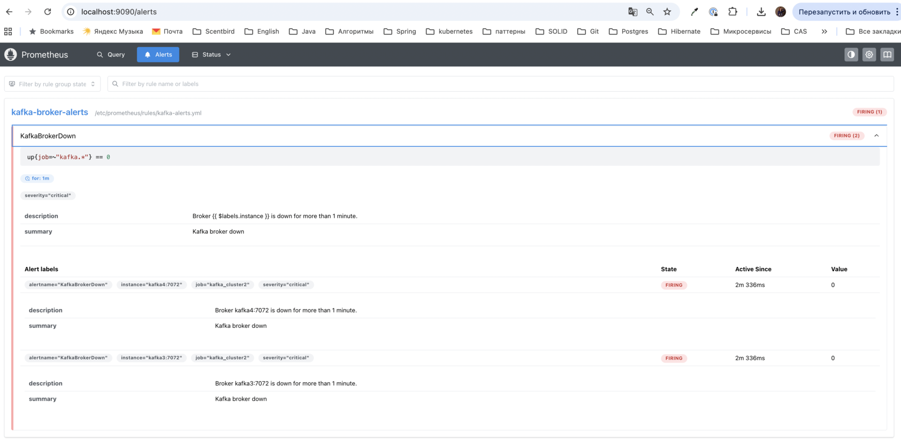

# План развертывания

1. Запуск кластера (два zookeeper'а, два кафка кластер по два кафка брокера в каждом, schema-registry на каждый кластер
   кафки, postgres, kafka-ui, prometheus, grafana).
2. Создание топиков и раздача прав на них и на группы (для обоих кластеров).
3. Регистрация схем в `Schema Registry` (для обоих кластеров).
4. Запуск `kafka connect`.
5. Запуск `SHOP API` и `CLIENT API`.
6. Запуск`MirrorMaker`.
7. Запуск `Аналитической системы` и `HDFS`.

# Запуск кластера

Запустите кластер командой:

```shell
docker-compose -f docker-compose-cluster.yml up -d
```

Подождите 1–2 минуты, пока все сервисы запустятся.

Будут созданы:

- два кафка кластера: условно №1 и №2.                 
  Кластер №1 - кластер, к которому будут подключаться `SHOP API` и `CLIENT API`.                 
  Кластер №2 - кластер, к которому будут подключаться `hdfs` и `аналитическая система`.
- postgres с двумя базами `shop_db` и `client_db`.                
  В базе `shop_db` будет создана таблица `product`.               
  В базе `client_db` будет создана таблица `client_request`.

# Топики и группы

- `products` - топик, куда будут попадать все продукты из файла `products.json` (`SHOP API`);
- `allowed-products` - топик, куда будут попадать только разрешенные продукты (`SHOP API`);
- `client-requests` - топик для клиентских запросов (`CLIENT API`).

Минимальное количество реплик для отказоустойчивости в двух брокерах (у меня в каждом кластере настроено именно
столько) - максимум 2.
Для синхронности нужно установить `min.insync.replicas = 2` на брокерах или `replication-factor = 2` в топиках.
Но из-за ограничений ноута, при таких настройках у меня всё время что-то отваливается.
Поэтому, что в docker-compose файле, что далее в топиках стоит значение 1.

## Команды

Все следующие команды собраны в файл [topics.sh](topics.sh). И можно не выполнять команды по одной, а запустить скрипт:

```shell
bash topics.sh
```

<details>
<summary>Описание команд (раскрыть)</summary>

Создаем топик `products` на кластере №1:

```
docker exec -e KAFKA_OPTS="" kafka1-1 kafka-topics \
  --create \
  --topic products \
  --bootstrap-server kafka1:19092 \
  --command-config /etc/kafka/secrets/admin-client-configs.conf \
  --partitions 1 \
  --replication-factor 1
```

Выдаем права продьюсеру:

```
docker exec -e KAFKA_OPTS="" kafka1-1 kafka-acls \
  --bootstrap-server kafka1:19092 \
  --command-config /etc/kafka/secrets/admin-client-configs.conf \
  --add \
  --allow-principal User:producer \
  --operation WRITE \
  --topic products
```

Создаем топик `allowed-products` на кластере №1:

```
docker exec -e KAFKA_OPTS="" kafka1-1 kafka-topics \
  --create \
  --topic allowed-products \
  --bootstrap-server kafka1:19092 \
  --command-config /etc/kafka/secrets/admin-client-configs.conf \
  --partitions 1 \
  --replication-factor 1
```

Выдаем права продьюсеру:

```
docker exec -e KAFKA_OPTS="" kafka1-1 kafka-acls \
  --bootstrap-server kafka1:19092 \
  --command-config /etc/kafka/secrets/admin-client-configs.conf \
  --add \
  --allow-principal User:producer \
  --operation WRITE \
  --topic allowed-products
```

Создаем топик `client-requests` на кластере №1:

```
docker exec -e KAFKA_OPTS="" kafka1-1 kafka-topics \
  --create \
  --topic client-requests \
  --bootstrap-server kafka1:19092 \
  --command-config /etc/kafka/secrets/admin-client-configs.conf \
  --partitions 1 \
  --replication-factor 1
```

Выдаем права продьюсеру:

```
docker exec -e KAFKA_OPTS="" kafka1-1 kafka-acls \
  --bootstrap-server kafka1:19092 \
  --command-config /etc/kafka/secrets/admin-client-configs.conf \
  --add \
  --allow-principal User:producer \
  --operation WRITE \
  --topic client-requests
```

### Права для Kafka Streams

Kafka Streams нужны права на группу `shop-api-service`, на чтение `products`, на запись в `allowed-products`.
Так как я везде использую `User:producer`, то на запись в `allowed-products` права уже выданы выше. Выдаем остальные.
На группу:

```
docker exec -e KAFKA_OPTS="" kafka1-1 kafka-acls \
  --bootstrap-server localhost:9092 \
  --command-config /etc/kafka/secrets/admin-client-configs.conf \
  --add \
  --allow-principal User:producer \
  --operation READ \
  --group shop-api-service
```

где `shop-api-service` задается в конфиге `SHOP API` в `kafka.streams-application-id`.

На чтение `products`:

```
docker exec -e KAFKA_OPTS="" kafka1-1 kafka-acls \
  --bootstrap-server localhost:9092 \
  --command-config /etc/kafka/secrets/admin-client-configs.conf \
  --add \
  --allow-principal User:producer \
  --operation READ \
  --topic products
```

### Права для Kafka Connect

Kafka Connect использует 3 служебных топика:

- connect-configs
- connect-offsets
- connect-status

И пользователь должен иметь права:

- READ
- WRITE
- CREATE
- DESCRIBE

```
docker exec -e KAFKA_OPTS="" kafka1-1 kafka-acls \
  --bootstrap-server localhost:9092 \
  --command-config /etc/kafka/secrets/admin-client-configs.conf \
  --add \
  --allow-principal User:kafkaconnect \
  --operation READ \
  --operation WRITE \
  --operation CREATE \
  --operation DESCRIBE \
  --topic connect-configs
  
docker exec -e KAFKA_OPTS="" kafka1-1 kafka-acls \
  --bootstrap-server localhost:9092 \
  --command-config /etc/kafka/secrets/admin-client-configs.conf \
  --add \
  --allow-principal User:kafkaconnect \
  --operation READ \
  --operation WRITE \
  --operation CREATE \
  --operation DESCRIBE \
  --topic connect-offsets
  
docker exec -e KAFKA_OPTS="" kafka1-1 kafka-acls \
  --bootstrap-server localhost:9092 \
  --command-config /etc/kafka/secrets/admin-client-configs.conf \
  --add \
  --allow-principal User:kafkaconnect \
  --operation READ \
  --operation WRITE \
  --operation CREATE \
  --operation DESCRIBE \
  --topic connect-status
```

А так же права на группы `kafka-connect` и `connect-allowed-products-postgres-sink`:

```
docker exec -e KAFKA_OPTS="" kafka1-1 kafka-acls \
  --bootstrap-server localhost:9092 \
  --command-config /etc/kafka/secrets/admin-client-configs.conf \
  --add \
  --allow-principal User:kafkaconnect \
  --operation READ \
  --group kafka-connect
  
docker exec -e KAFKA_OPTS="" kafka1-1 kafka-acls \
  --bootstrap-server localhost:9092 \
  --command-config /etc/kafka/secrets/admin-client-configs.conf \
  --add \
  --allow-principal User:kafkaconnect \
  --operation READ \
  --group connect-allowed-products-postgres-sink
```

И права на топик `allowed-products`:

```
docker exec -e KAFKA_OPTS="" kafka1-1 kafka-acls \
  --bootstrap-server kafka1:19092 \
  --command-config /etc/kafka/secrets/admin-client-configs.conf \
  --add \
  --allow-principal User:kafkaconnect \
  --operation READ \
  --operation DESCRIBE \
  --topic allowed-products
```

### кластер №2

Создаем топик `recommendations` на кластере №2:

```
docker exec -e KAFKA_OPTS="" kafka2-1 kafka-topics \
  --create \
  --topic recommendations \
  --bootstrap-server kafka3:19094 \
  --command-config /etc/kafka/secrets/admin-client-configs.conf \
  --partitions 1 \
  --replication-factor 1
```

Добавляем прав юзеру `hdfs` на запись в топик `recommendations` в кластере №2:

```
docker exec -e KAFKA_OPTS="" kafka2-1 kafka-acls \
  --bootstrap-server kafka3:19094 \
  --command-config /etc/kafka/secrets/admin-client-configs.conf \
  --add \
  --allow-principal User:hdfs \
  --operation WRITE \
  --topic recommendations
```

Добавляем прав юзеру `hdfs` на чтение топиков `allowed-products` и `client-requests` в кластере №2:

```
docker exec -e KAFKA_OPTS="" kafka2-1 kafka-acls \
  --bootstrap-server kafka3:19094 \
  --command-config /etc/kafka/secrets/admin-client-configs.conf \
  --add \
  --allow-principal User:hdfs \
  --operation READ \
  --topic allowed-products

docker exec -e KAFKA_OPTS="" kafka2-1 kafka-acls \
  --bootstrap-server kafka3:19094 \
  --command-config /etc/kafka/secrets/admin-client-configs.conf \
  --add \
  --allow-principal User:hdfs \
  --operation READ \
  --group allowed-products.2

docker exec -e KAFKA_OPTS="" kafka2-1 kafka-acls \
  --bootstrap-server kafka3:19094 \
  --command-config /etc/kafka/secrets/admin-client-configs.conf \
  --add \
  --allow-principal User:hdfs \
  --operation READ \
  --topic client-requests
  
docker exec -e KAFKA_OPTS="" kafka2-1 kafka-acls \
  --bootstrap-server kafka3:19094 \
  --command-config /etc/kafka/secrets/admin-client-configs.conf \
  --add \
  --allow-principal User:hdfs \
  --operation READ \
  --group client-requests.2
```

</details>

# Schema Registry

Схема [product.avsc](common/src/main/avro/product.avsc).           
Схема [client.request.avsc](common/src/main/avro/client.request.avsc).
Схема [recommendation.avsc](common/src/main/avro/recommendation.avsc).

Регистрируем схему для топика `products` на кластере №1:

```
curl -X POST http://localhost:8081/subjects/products-value/versions \
-H "Content-Type: application/vnd.schemaregistry.v1+json" \
-d '{
  "schema": "{\"type\": \"record\", \"name\": \"ProductAvro\", \"namespace\": \"ru.valeripaw.kafka.dto\", \"version\": \"1\", \"fields\": [{\"name\": \"product_id\", \"type\": \"string\"}, {\"name\": \"name\", \"type\": \"string\"}, {\"name\": \"description\", \"type\": [\"null\", \"string\"], \"default\": null}, {\"name\": \"price\", \"type\": {\"name\": \"PriceAvro\", \"type\": \"record\", \"fields\": [{\"name\": \"amount\", \"type\": [\"null\", \"double\"], \"default\": null}, {\"name\": \"currency\", \"type\": [\"null\", \"string\"], \"default\": null}]}}, {\"name\": \"category\", \"type\": \"string\"}, {\"name\": \"brand\", \"type\": \"string\"}, {\"name\": \"stock\", \"type\": {\"name\": \"StockAvro\", \"type\": \"record\", \"fields\": [{\"name\": \"available\", \"type\": [\"null\", \"int\"], \"default\": null}, {\"name\": \"reserved\", \"type\": [\"null\", \"int\"], \"default\": null}]}}, {\"name\": \"sku\", \"type\": \"string\"}, {\"name\": \"specifications\", \"type\": [\"null\", {\"name\": \"SpecificationsAvro\", \"type\": \"record\", \"fields\": [{\"name\": \"weight\", \"type\": [\"null\", \"string\"], \"default\": null}, {\"name\": \"dimensions\", \"type\": [\"null\", \"string\"], \"default\": null}, {\"name\": \"battery_life\", \"type\": [\"null\", \"string\"], \"default\": null}, {\"name\": \"water_resistance\", \"type\": [\"null\", \"string\"], \"default\": null}]}], \"default\": null}, {\"name\": \"created_at\", \"type\": \"string\"}, {\"name\": \"updated_at\", \"type\": \"string\"}, {\"name\": \"index\", \"type\": \"string\"}, {\"name\": \"store_id\", \"type\": \"string\"}, {\"name\": \"tags\", \"default\": null, \"type\": [\"null\", {\"type\": \"array\", \"items\": \"string\"}]}, {\"name\": \"images\", \"default\": null, \"type\": [\"null\", {\"type\": \"array\", \"items\": {\"name\": \"ImageAvro\", \"type\": \"record\", \"fields\": [{\"name\": \"url\", \"type\": \"string\"}, {\"name\": \"alt\", \"type\": [\"null\", \"string\"], \"default\": null}]}}]}]}"
}'
```

В ответе будет что-то похожее на:

```json
{
  "id": 1,
  "version": 1,
  "guid": "2ad0f59e-dd54-286e-275b-1d425f722d85",
  "schemaType": "AVRO",
  "schema": "<schema>"
}
```

Регистрируем схему для топика `client-requests` на кластере №1:

```
curl -X POST http://localhost:8081/subjects/client-requests-value/versions \
-H "Content-Type: application/vnd.schemaregistry.v1+json" \
-d '{
  "schema": "{\"type\": \"record\", \"name\": \"ClientRequestAvro\", \"namespace\": \"ru.valeripaw.kafka.dto\", \"version\": \"1\", \"fields\": [{\"name\": \"type\", \"type\": \"string\"}, {\"name\": \"query\", \"type\": \"string\"}, {\"name\": \"created_at\", \"type\": \"long\"}]}"
}'
```

В ответе будет что-то похожее на:

```json
{
  "id": 2,
  "version": 1,
  "guid": "14e507f2-a281-f8bc-42a7-11cc836ffcf4",
  "schemaType": "AVRO",
  "schema": "<schema>"
}
```

Пример сообщения для топика `client-requests`:

```json
{
  "type": "SEARCH_PRODUCT_REQUEST",
  "query": "Умные часы",
  "created_at": 1719991111
}
```

- `"type": "SEARCH_PRODUCT_REQUEST"` - для поиска, для рекомендаций - `"type": "RECOMMENDATION_REQUEST"`.

Регистрируем схему для топика `recommendations` на кластере №2:

```
curl -X POST http://localhost:8079/subjects/recommendations-value/versions \
-H "Content-Type: application/vnd.schemaregistry.v1+json" \
-d '{
  "schema": "{\"type\": \"record\", \"name\": \"RecommendationAvro\", \"namespace\": \"ru.valeripaw.kafka.dto\", \"fields\": [{\"name\": \"query\", \"type\": \"string\"}, {\"name\": \"product_id\", \"type\": \"string\"}, {\"name\": \"purchased_count\", \"type\": \"long\"}, {\"name\": \"viewed_count\", \"type\": \"long\"}, {\"name\": \"event_count\", \"type\": \"long\"}]}"
}'
```

В ответе будет что-то похожее на:

```json
{
  "id": 5,
  "version": 1,
  "guid": "2d74bb57-da58-cefe-56f9-bd21a01d0e49",
  "schemaType": "AVRO",
  "schema": "..."
}
```

# Kafka Connect

Запустите кластер командой:

```shell
docker-compose -f docker-compose-kafka-konnect.yml up -d
```

Подождите 1–2 минуты, пока все сервисы запустятся.

Конфиг [config.json](common/kafka-connect/config.json).

Таблица `product` уже создана.

Создание коннектора:

```
curl -X POST http://localhost:8083/connectors \
  -H "Content-Type: application/json" \
  --data-binary "@common/kafka-connect/config.json" 
```

Проверить статус:

```
curl http://localhost:8083/connectors/allowed-products-postgres-sink/status
```

В ответе должно быть что-то похожее на:

```json
{
  "name": "allowed-products-postgres-sink",
  "connector": {
    "state": "RUNNING",
    "worker_id": "kafka-connect:8083"
  },
  "tasks": [
    {
      "id": 0,
      "state": "RUNNING",
      "worker_id": "kafka-connect:8083"
    }
  ],
  "type": "sink"
}
```

Если по какой-то причине коннектор нужно удалить:

```
curl -X DELETE http://localhost:8083/connectors/allowed-products-postgres-sink
```

# SHOP API

Запустите `SHOP API` командой:

```shell
docker-compose -f docker-compose-shop-api.yml up -d
```

```
products.json
    │
    ▼
File Watcher
    │
    ▼
ProductEventService
    │
    ▼
Kafka Producer
    │
    ▼
Kafka topic: products
    │
    ▼
Kafka Streams
    │
    ▼
filter banned products
    │
    ▼
Kafka topic: allowed-products
    │
    ▼
Kafka Connect JDBC Sink
    │
    ▼
Postgres: product table
```

Приложение слушает изменения в файле `products.json`.                    
Все продукты из файла `products.json` попадают в топик `products`. Далее продукты из этого топика проходят фильтрацию на
запрещенные и попадают в топик `allowed-products`, и уже из топика `allowed-products` записываются в бд в
таблицу `product`.             
Чтобы хоть что-то произошло, достаточно просто открыть файл `products.json`.

# CLIENT API

Запустите `CLIENT API` командой:

```shell
docker-compose -f docker-compose-client-api.yml up -d
```

```
REST or CLI
    │
    ▼
Postgres: client_request table
    │
    ▼
Kafka topic: client-requests
```

Приложение реализует команды:

- поиск информации о товаре по его имени
- получение персонализированных рекомендаций
  двумя способами: через REST и через терминал (использовать терминал в контейнерах не очень удобно, нужно
  конфигурировать отдельно, поэтому продублировала по ресту).

По REST можно отправить запросы:
поиск информации о товаре по его имени

```
curl --get \
  --data-urlencode "name=Планшет TabMax" \
  http://localhost:9197/api/product/search
```

получение персонализированных рекомендаций

```
curl --get \
  --data-urlencode "category=Электроника" \
  http://localhost:9197/api/product/recommendation
```

Запросы сохраняются в кластере №1 в топик `client-requests`, а так же в бд `client_db` в таблицу `client_request`.
Продукты в ответе берутся из бд `shop_db` из таблицы `product`.

# MirrorMaker

Запустите `MirrorMaker` командой:

```shell
docker-compose -f docker-compose-mirror-maker.yml up -d
```

На кластере №2 будут созданы топики `products`, `allowed-products`, `client-requests` со всем их содержимым как в
кластере №1.             
А так же несколько служебных: `mm2-status.source.internal`, `mm2-offsets.source.internal`,
`mm2-configs.source.internal`,
`heartbeats`.                
Все права `ACL` так же будут перенесены.

Если `MirrorMaker` оставить запущеным, он почти в реальном времени будет переносить данные с кластера №1 на кластер №2.

# Аналитическая система и HDFS

Запустите `HDFS` командой:

```
docker-compose -f docker-compose-hdfs.yml up -d
```

После запуска контейнера можно воспользоваться веб-интерфейсами `Hadoop`, перейдя по адресам:

- Веб-интерфейс `HDFS NameNode`: http://localhost:9870
- Веб-интерфейс `HDFS DataNode №1`: http://localhost:9864
- Веб-интерфейс `HDFS DataNode №2`: http://localhost:9865

В процессе отладки обнаружила, что нельзя просто таки писать в контейнер hdfs, нужны права на запись на уровне файловой
системы.    
Поэтому внутри контейнера `namenode` необходимо дополнительно сделать:

```
# 1. Создаём директорию /data
hdfs dfs -mkdir -p /data
hdfs dfs -mkdir -p /data/allowed-products
hdfs dfs -mkdir -p /data/client-requests

# 2. Даём права на чтение, запись и выполнение 
hdfs dfs -chmod 777 /data
hdfs dfs -chmod 777 /data/allowed-products
hdfs dfs -chmod 777 /data/client-requests

# 2.1. Проверяем, поменялся набор прав
hdfs dfs -ls /

    Found 1 items
    drwxrwxr-x   - root supergroup          0 2026-03-22 10:09 /data

hdfs dfs -ls /data

    Found 2 items
    drwxrwxr-x   - root supergroup          0 2026-03-22 12:00 /data/allowed-products
    drwxrwxr-x   - root supergroup          0 2026-03-22 12:00 /data/client-requests
```

Посмотреть содержимое директории `/data` в HDFS:

```
hdfs dfs -ls /data
```

команду нужно выполнить в контейнере `namenode`.

Еще в процессе работы оказалось, что настройка:

```
<property>
  <name>dfs.replication</name>
  <value>1</value>
</property>
```

контейнером проигнорировалась. Помогло выполнить внутри контейнера `namenode`:

```
hdfs dfs -setrep -w 1 /data
hdfs dfs -setrep -w 1 /data/allowed-products
hdfs dfs -setrep -w 1 /data/client-requests
```

Следующая проблема была с правами уже у `datanode1` и `datanode2`:

```
chmod -R 777 /hdfs/datanode
```

## Аналитическая система

Запустите командой:

```
docker-compose -f docker-compose-analytical-system.yml up -d
```

После запуска, приложение будет автоматически собирать данные с топиков `allowed-products` и `client-requests` и
складывать их в файлы в формате `json` в файловую систему `hdfs`.

Чтобы запустить расчеты рекомендаций на Spark нужно выполнить команду:

```
curl -X POST http://localhost:9063/api/spark/run
```

После это данные будут сохранены в файловой системе `hdfs` по пути `/analytics/recommendations` и затем отправлены в
топик `recommendations` кластера №2.

Архитектура аналитической системы

```
Kafka кластер №2: топики allowed-products и client-requests
    │
    ▼
Kafka Consumer (Java)
    │
    ▼
HDFS (raw data)
 ├── /data/client-requests/
 └── /data/products/
    │
    ▼
Spark аналитика
    │
    ▼
рекомендации
    │
    ▼
Kafka кластер №2: топик recommendations
```

# Prometheus, Alertmanager и Grafana

Prometheus должен открываться по адресу http://localhost:9090.
В http://localhost:9090/alerts можно увидеть правило алерта. И сам алерт, если какой-то из брокеров не будет работать.



Alertmanager должен открываться по адресу `http://localhost:9014/#/alerts`.

Grafana должна открываться по адресу `http://localhost:3000`.

Логин: `admin`
Пароль: `admin`               
Почему-то входит только со второго раза.

Локально метрики можно посмотреть по адресам:

- http://localhost:7080/metrics (кластер №1 брокер №1)
- http://localhost:7081/metrics (кластер №1 брокер №2)
- http://localhost:7082/metrics (кластер №2 брокер №1)
- http://localhost:7083/metrics (кластер №12 брокер №2)

Готовый дашборд сохранен в файле [kafka-cluster.json](common/grafana/dashboards/kafka-cluster.json) 
и доступен по адресу `http://localhost:3000/d/adc5zdt/new-dashboard?orgId=1&from=now-1h&to=now&timezone=browser`.

# Остановка кластера

1. Остановите кластер командой:

```shell
docker-compose down
```

2. Для полной очистки (включая данные) можно использовать команду:

```shell
docker-compose down -v
```
